# AI-SOC — Wazuh + Local LLM Alert Triage

> **AI-powered Security Operations Center (SOC) proof of concept using Wazuh, Windows 10, Kali Linux, Ollama, Llama 3.1 8B, and a custom AI-SOC dashboard.**

## 1. Project Overview

This project is a virtual SOC laboratory designed to demonstrate how security events can be:

```text
Detected
   ↓
Collected by Wazuh
   ↓
Investigated
   ↓
Analyzed by a local LLM
   ↓
Converted into an AI-assisted incident
   ↓
Displayed through a custom SOC dashboard
```

The project combines traditional SIEM/endpoint monitoring with a locally hosted AI model to assist with alert triage and investigation.

The AI layer is designed as an **analyst-assistance system**, not as an autonomous replacement for a human security analyst.

---

## 2. Lab Architecture

```text
                         Windows 11 Host
                              │
                            VMware
                              │
              ┌───────────────┼────────────────┐
              │               │                │
              ▼               ▼                ▼
           Ubuntu          Windows 10         Kali
        Wazuh Server      Wazuh Agent       Security
        + AI-SOC          Monitored          Testing
        Backend           Endpoint           VM
              │
              │ Wazuh Alerts
              ▼
        Wazuh Manager
              │
              ├──────────────► Wazuh Dashboard
              │
              ▼
       Wazuh alerts.json
              │
              ▼
        AI-SOC Backend
              │
              ▼
        Ollama / Llama 3.1 8B
              │
              ▼
        AI Incident Analysis
              │
              ▼
        AI-SOC Web Dashboard
```

### Roles

| System     | Role                              |
| ---------- | --------------------------------- |
| Windows 11 | VMware host and local Ollama host |
| Ubuntu     | Wazuh server and AI-SOC backend   |
| Windows 10 | Monitored endpoint                |
| Kali Linux | Security testing environment      |

---

## 3. Technologies Used

* Wazuh 4.14.7
* Wazuh Manager
* Wazuh Indexer
* Wazuh Dashboard
* Filebeat
* Windows 10 Wazuh Agent
* Ubuntu 24.04
* Kali Linux
* Python 3.12
* FastAPI
* SQLite
* Ollama
* Llama 3.1 8B
* VMware

---

# 4. Project Goals

The POC was designed to demonstrate:

1. Centralized endpoint monitoring with Wazuh.
2. Windows authentication-event detection.
3. File Integrity Monitoring.
4. Vulnerability detection.
5. MITRE ATT&CK investigation.
6. AI-assisted security alert triage.
7. Automatic Wazuh alert processing.
8. Presentation of AI-generated incident information through a custom dashboard.

---

# 5. Lab Setup

## Step 1 — Virtual SOC Environment

The laboratory consists of three VMware virtual machines:

```text
Ubuntu
 └── Wazuh Server + AI-SOC

Windows 10
 └── Wazuh Agent

Kali Linux
 └── Security testing
```

The physical Windows 11 machine acts as the VMware host and also runs Ollama for the local LLM.

### Evidence

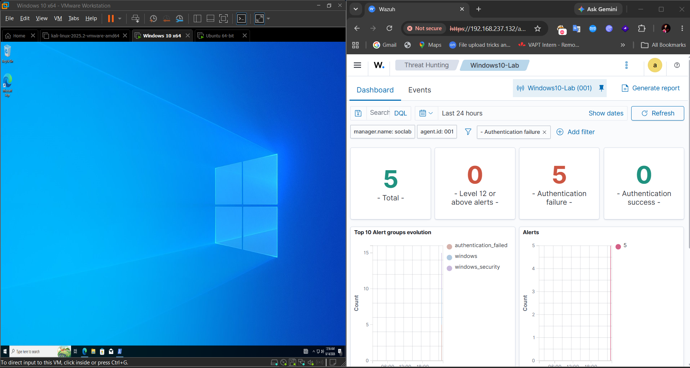

---

# 6. Wazuh Server Deployment

Ubuntu was configured as the centralized Wazuh platform.

The all-in-one Wazuh deployment provides:

```text
Wazuh Indexer
Wazuh Manager
Filebeat
Wazuh Dashboard
```

The Wazuh web interface was successfully made accessible from the VMware network.

### Evidence

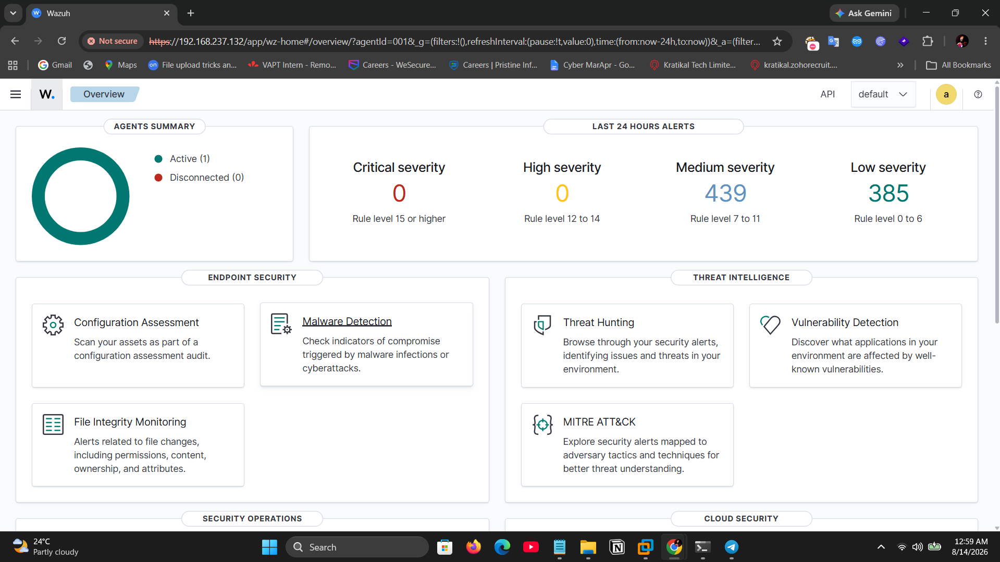

---

# 7. Windows 10 Agent Enrollment

Windows 10 was enrolled as a Wazuh endpoint.

The endpoint appears in Wazuh as:

```text
Windows10-Lab
```

The agent successfully established communication with the Wazuh server.

### Evidence

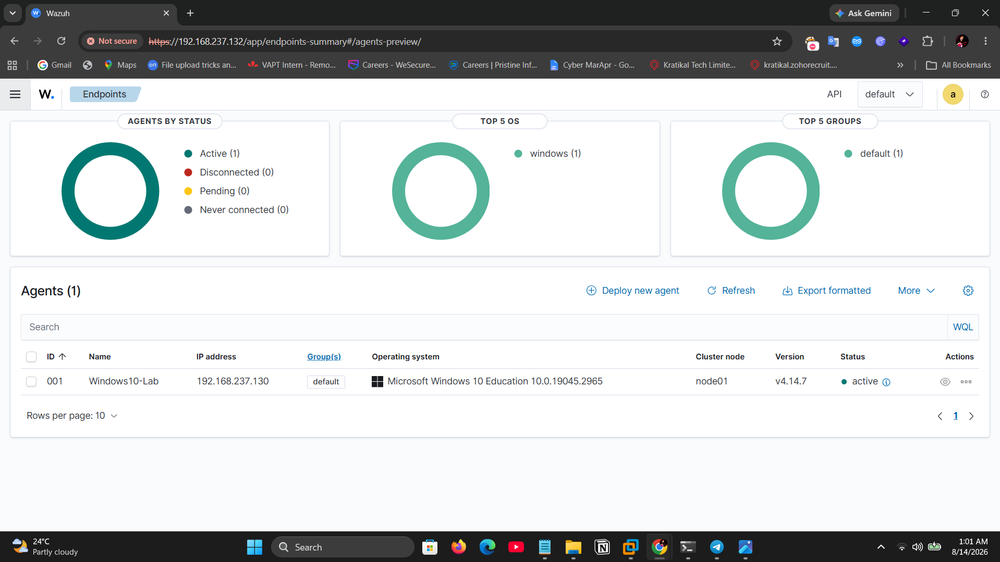

---

# 8. Authentication Failure Detection

A dedicated Windows login test was performed using the local `pawan` account.

Controlled incorrect-password attempts generated Windows Security Event:

```text
Event ID: 4625
```

Wazuh detected the activity with:

```text
Rule ID: 60122
Logon Failure - Unknown user or bad password
```

The event flow was:

```text
Incorrect password
       ↓
Windows Security Event 4625
       ↓
Wazuh Agent
       ↓
Wazuh Manager
       ↓
Rule 60122
       ↓
Authentication Failure Alert
```

### Evidence — Detection

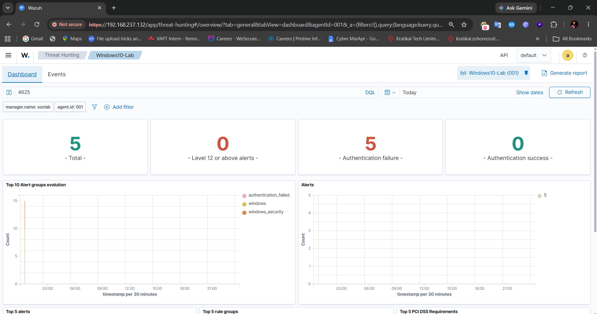

### Evidence — Investigation

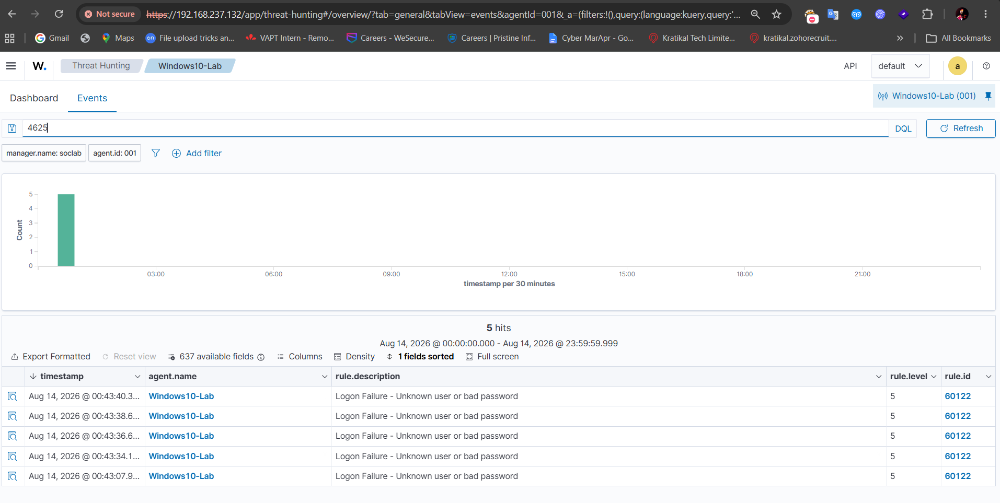

---

# 9. File Integrity Monitoring

A dedicated laboratory directory was created on Windows:

```text
C:\SOC-Lab
```

A test file was created and modified to demonstrate File Integrity Monitoring.

The workflow was:

```text
File Created / Modified
        ↓
Wazuh Agent
        ↓
File Integrity Monitoring
        ↓
Wazuh Event
        ↓
SOC Investigation
```

### Evidence

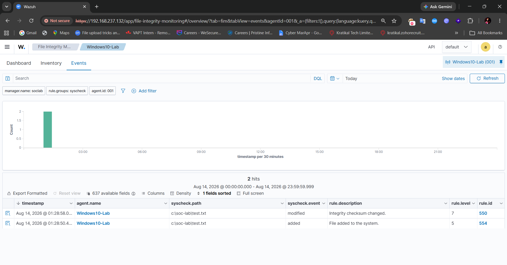

---

# 10. Vulnerability Detection

The Windows 10 endpoint was intentionally kept in its existing laboratory state so that the Wazuh vulnerability engine could identify vulnerabilities associated with installed software.

The investigation included:

* Vulnerability ID / CVE
* Affected software
* Installed version
* Severity
* Status

### Evidence — Vulnerability Inventory

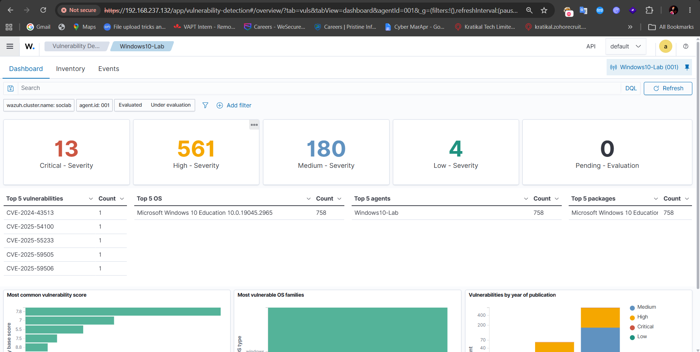

### Evidence — Vulnerability Investigation

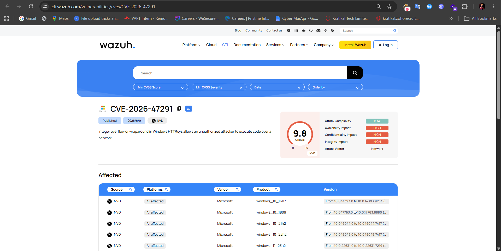

---

# 11. MITRE ATT&CK Investigation

Wazuh alert metadata was reviewed using the MITRE ATT&CK integration.

The investigation focused on understanding:

```text
Tactic
Technique
Technique ID
Associated Event
Detection Context
```

An important design decision was made for the AI layer:

> Wazuh-provided MITRE mappings are treated as contextual information and are independently evaluated by the AI rather than being blindly accepted as fact.

### Evidence

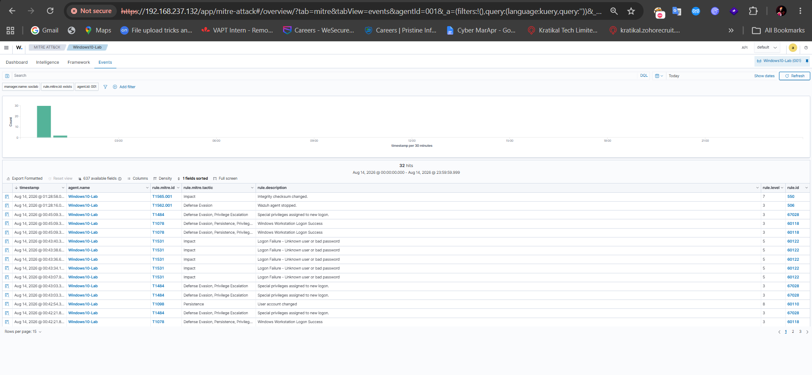

---

# 12. AI-SOC Architecture

After validating the Wazuh detections, a local AI analysis layer was added.

The first stage was a Python-based Wazuh alert analyzer.

The final workflow is:

```text
Wazuh Alert
     ↓
Alert Collector
     ↓
Relevant Security Fields
     ↓
Ollama
     ↓
Llama 3.1 8B
     ↓
Structured AI Analysis
     ↓
Incident Record
     ↓
AI-SOC Dashboard
```

---

# 13. Local AI Model

The project uses:

```text
Model: Llama 3.1 8B
Runtime: Ollama
Location: Windows 11 Host
```

The model is accessed over the VMware network by the Ubuntu AI-SOC backend.

Using a local model means the core alert-analysis workflow does not require a commercial cloud LLM API.

---

# 14. AI Evidence-Aware Triage

The AI was deliberately designed not to blindly repeat Wazuh's interpretation.

For example, the original Wazuh authentication event contained:

```text
Event ID: 4625
Rule: 60122
Failed authentication attempts: 5
```

The supplied Wazuh MITRE context included:

```text
T1531 - Account Access Removal
```

The AI was instructed to independently evaluate the mapping.

The improved analysis identified that the authentication failure event did **not** provide sufficient evidence to support the supplied account-access-removal technique.

This creates a more useful workflow:

```text
Wazuh Telemetry
      ↓
Existing SIEM Context
      ↓
AI Evidence Review
      ↓
Facts vs Assumptions
      ↓
Analyst-Oriented Assessment
```

### Evidence

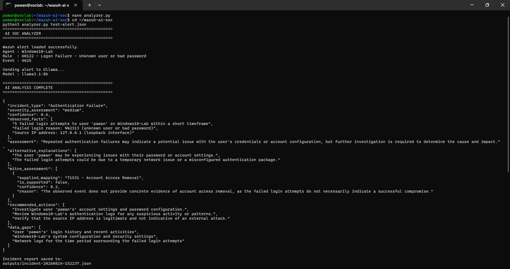

---

# 15. AI Analysis Output

The AI produces structured information rather than an unstructured chatbot response.

Example output fields:

```text
Incident Type
Severity Assessment
Confidence
Observed Facts
Assessment
Alternative Explanations
MITRE Assessment
Recommended Actions
Data Gaps
```

Example:

```json
{
  "incident_type": "Authentication Failure",
  "severity_assessment": "medium",
  "confidence": 0.6,
  "assessment": "Repeated authentication failures may indicate suspicious activity, but further investigation is required."
}
```

The structured output is then stored as an incident record.

---

# 16. Automated AI-SOC Backend

The command-line AI prototype was extended into an automated backend.

The backend performs:

```text
New Wazuh Alert
       ↓
Automatic Collection
       ↓
Alert Normalization
       ↓
AI Analysis
       ↓
SQLite Incident Storage
       ↓
FastAPI API
       ↓
AI-SOC Web Dashboard
```

The system no longer requires the analyst to manually copy an alert into the AI analyzer.

---

# 17. AI-SOC Web Dashboard

A custom FastAPI-based web interface was created to visualize the AI-generated incidents.

The dashboard displays:

* Total incidents
* Severity counts
* Endpoint information
* Wazuh rule information
* AI-generated summaries
* AI incident details

### Evidence — Dashboard

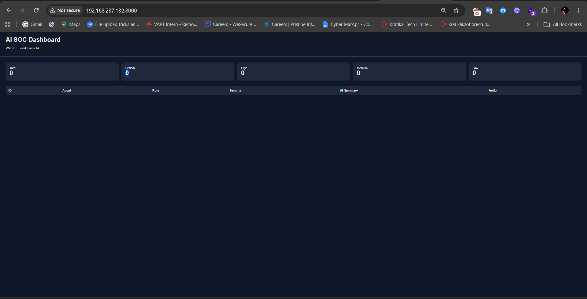

---

# 18. Automated AI Incident

A new Wazuh alert was generated after the automated AI-SOC backend was running.

The complete workflow was successfully demonstrated:

```text
Windows 10 Event
       ↓
Wazuh
       ↓
Wazuh Alert
       ↓
AI-SOC Collector
       ↓
Ollama / Llama 3.1 8B
       ↓
AI Analysis
       ↓
SQLite
       ↓
AI-SOC Dashboard
```

### Evidence

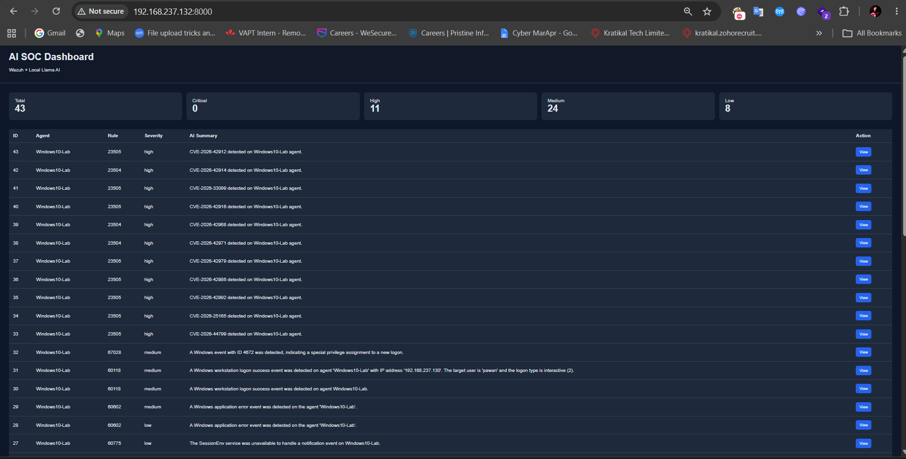

---

# 19. Proof of Concept Results

The POC successfully demonstrated:

| Capability                        | Result       |
| --------------------------------- | ------------ |
| Wazuh deployment                  | Completed    |
| Windows endpoint enrollment       | Completed    |
| Windows authentication monitoring | Demonstrated |
| Failed-login detection            | Demonstrated |
| File Integrity Monitoring         | Demonstrated |
| Vulnerability detection           | Demonstrated |
| MITRE ATT&CK investigation        | Demonstrated |
| Local LLM integration             | Demonstrated |
| AI alert analysis                 | Demonstrated |
| Evidence-aware AI triage          | Demonstrated |
| Automated incident processing     | Demonstrated |
| Custom AI-SOC dashboard           | Demonstrated |

The primary proof is the end-to-end path:

```text
Security Event
      ↓
Wazuh Detection
      ↓
AI Analysis
      ↓
Incident
      ↓
SOC Dashboard
```

---

# 20. Project Evidence

The repository contains selected screenshots rather than raw logs or sensitive runtime data.

Recommended evidence order:

```text
01  Lab environment
02  Wazuh dashboard
03  Windows agent active
04  Authentication detection
05  Authentication event investigation
06  File Integrity Monitoring
07  Vulnerability inventory
08  Vulnerability investigation
09  MITRE ATT&CK investigation
13  AI evidence-aware analysis
14  AI-SOC dashboard
15  Automated AI incident
```

The screenshots are intended to show the project chronologically from infrastructure setup through automated AI analysis.

---

# 21. Security and Privacy

This repository is a proof-of-concept project.

The following should never be published:

```text
Wazuh passwords
Private keys
Certificates
API keys
.env files
Generated credential archives
Raw alert databases
Unredacted machine-specific secrets
```

Runtime files and local AI-generated incident data are excluded from the public repository.

AI-generated recommendations should always be reviewed by a human analyst before taking security actions.

---

# 22. Limitations

This is an educational proof of concept and is not intended to replace a production SOC platform.

Current limitations include:

* Local LLM accuracy depends on the model and available hardware.
* AI output can contain incorrect or incomplete reasoning.
* MITRE validation is probabilistic.
* Incident correlation is intentionally lightweight.
* SQLite is used for the POC rather than a production database.
* The dashboard is designed for demonstration.
* Production deployments would require stronger authentication and authorization.
* Automated response actions are intentionally not allowed to execute arbitrary commands.

---

# 23. Future Improvements

Possible next improvements include:

* Better alert correlation
* Alert deduplication
* More advanced incident lifecycle management
* Analyst authentication
* Role-based access control
* Threat-intelligence enrichment
* Case management
* SOAR-style response with human approval
* AI model evaluation and benchmarking
* Production database
* Improved dashboard analytics
* Multiple endpoint support

---

# 24. Final Demonstration

A final project demonstration video will show the complete workflow:

```text
1. Lab Architecture
        ↓
2. Wazuh Dashboard
        ↓
3. Windows 10 Endpoint
        ↓
4. Security Alert
        ↓
5. Wazuh Investigation
        ↓
6. AI Analysis
        ↓
7. AI-SOC Dashboard
        ↓
8. Automatic Incident Processing
```

The final video should be uploaded to the repository under:

```text
demo/final-demo.mp4
```

---

# 25. Conclusion

This project demonstrates a practical AI-assisted SOC workflow combining conventional security monitoring with a locally hosted LLM.

The final system connects:

```text
Endpoint Telemetry
       +
Wazuh Detection
       +
AI-Assisted Triage
       +
Incident Management
       +
SOC Visualization
```

The goal is not to replace the SOC analyst.

The goal is to reduce manual alert-triage effort, provide additional context, identify unsupported assumptions, and give analysts a structured starting point for investigation.

---

## Disclaimer

This project was developed in an isolated cybersecurity laboratory for educational and defensive-security purposes. Testing should only be performed against systems that you own or have explicit authorization to assess.
